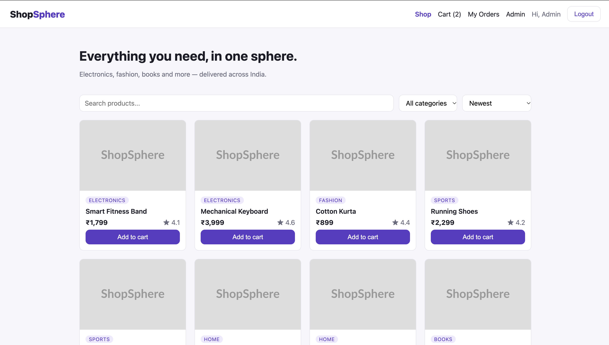
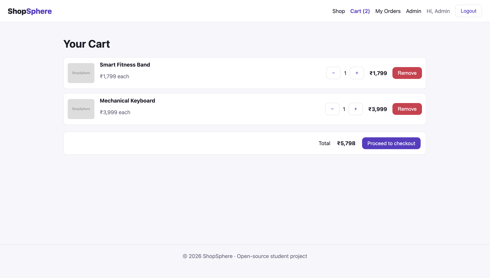

# 🛒 ShopSphere

**ShopSphere** is a full-stack e-commerce web app built with the **MERN stack** (MongoDB, Express, React, Node.js). It is designed as a **beginner-friendly open-source project** — the code is clean, the scope is real, and there are plenty of open issues for you to pick up.

## ✨ Features

- 🔐 JWT authentication (register / login) with customer and admin roles
- 🛍️ Product listing with search, category filter and sorting
- 📦 Product detail page with stock status
- 🧺 Shopping cart (saved in localStorage)
- 🚚 Checkout with shipping address and Cash on Delivery
- 📜 Order history for customers
- 🛠️ Admin panel: add / edit / delete products, update order status
## 📸 Screenshots

### Home page



### Shopping cart



## 🧱 Tech stack

| Layer    | Tech                                   |
| -------- | -------------------------------------- |
| Frontend | React 18, Vite, React Router, Axios    |
| Backend  | Node.js, Express, JWT, bcrypt          |
| Database | MongoDB with Mongoose                  |

## 📁 Folder structure

```
shopsphere/
├── client/                 # React frontend (Vite)
│   └── src/
│       ├── api/            # Axios instance
│       ├── components/     # Navbar, ProductCard, ProtectedRoute...
│       ├── context/        # AuthContext, CartContext
│       ├── pages/          # Home, Cart, Checkout, Orders, admin/*
│       └── utils/
└── server/                 # Express API
    └── src/
        ├── config/         # MongoDB connection
        ├── controllers/    # Route logic
        ├── middleware/     # auth + error handling
        ├── models/         # User, Product, Order
        ├── routes/
        └── seed/           # Sample data
```

## 🚀 Getting started

**Prerequisites:** Node.js 18+, MongoDB (local or a free [MongoDB Atlas](https://www.mongodb.com/atlas) cluster).

```bash
# 1. Fork this repo, then clone your fork
git clone https://github.com/<your-username>/shopsphere.git
cd shopsphere

# 2. Backend
cd server
cp .env.example .env        # edit MONGO_URI and JWT_SECRET
npm install
npm run seed                # loads sample products + 2 users
npm run dev                 # API on http://localhost:5000

# 3. Frontend (new terminal)
cd client
npm install
npm run dev                 # app on http://localhost:5173
```

**Demo accounts (after seeding):**

| Role     | Email                    | Password    |
| -------- | ------------------------ | ----------- |
| Admin    | admin@shopsphere.dev     | admin123    |
| Customer | customer@shopsphere.dev  | customer123 |

## 🔌 API reference

| Method | Endpoint                  | Access   | Description              |
| ------ | ------------------------- | -------- | ------------------------ |
| POST   | `/api/auth/register`      | Public   | Create account           |
| POST   | `/api/auth/login`         | Public   | Login, returns JWT       |
| GET    | `/api/auth/me`            | User     | Current user profile     |
| PUT    | `/api/auth/me`            | User     | Update name / address    |
| GET    | `/api/products`           | Public   | List (search, filter, sort) |
| GET    | `/api/products/:id`       | Public   | Product detail           |
| POST   | `/api/products`           | Admin    | Create product           |
| PUT    | `/api/products/:id`       | Admin    | Update product           |
| DELETE | `/api/products/:id`       | Admin    | Delete product           |
| POST   | `/api/orders`             | User     | Place order              |
| GET    | `/api/orders/mine`        | User     | My orders                |
| GET    | `/api/orders/:id`         | Owner/Admin | Order detail          |
| GET    | `/api/orders`             | Admin    | All orders               |
| PATCH  | `/api/orders/:id/status`  | Admin    | Change order status      |

## 🤝 Contributing

We ❤️ contributions! Read **[CONTRIBUTING.md](./CONTRIBUTING.md)** and pick an issue labelled
[`good first issue`](../../issues?q=is%3Aissue+is%3Aopen+label%3A%22good+first+issue%22).

## 📄 License

[MIT](./LICENSE)
